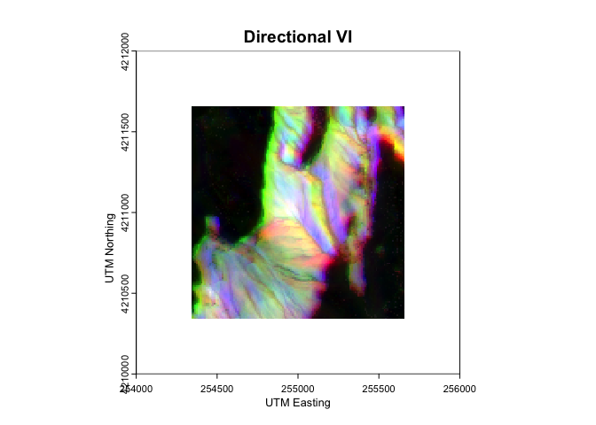
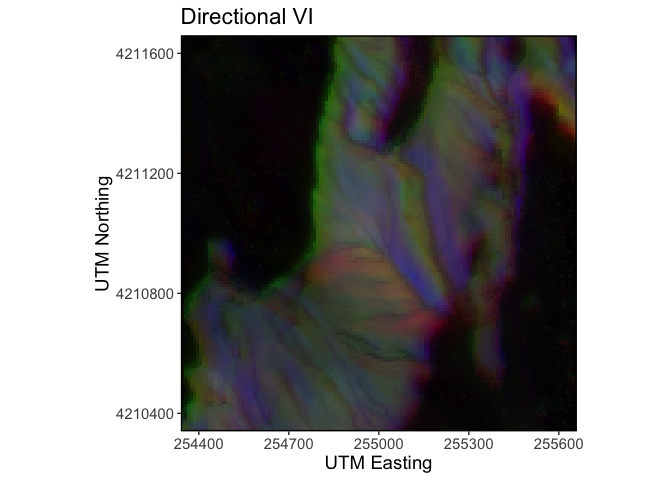

VisiMod: Map Modeled Visibility Index Across Wildland Landscapes
================
Katherine Mistick
2023-10-05

- <a href="#1-intoduction" id="toc-1-intoduction"><strong>1
  Intoduction</strong></a>
- <a href="#2-download-lidar-data-to-prepare-for-visimod-workflow"
  id="toc-2-download-lidar-data-to-prepare-for-visimod-workflow"><strong>2
  Download lidar data to prepare for VisiMod workflow</strong></a>
- <a href="#3-the-visimod-workflow"
  id="toc-3-the-visimod-workflow"><strong>3 The VisiMod
  Workflow</strong></a>
- <a href="#4-using-visimod-to-generate-an-rgb-vi-map"
  id="toc-4-using-visimod-to-generate-an-rgb-vi-map"><strong>4 Using
  VisiMod() to generate an RGB VI map</strong></a>

------------------------------------------------------------------------

## **1 Intoduction**

The VisiMod package was built to facilitate visibility analyses. It
provides a suite of tools that allows users to build predictive models
that can map visibility (in terms of visibility index (VI) where VI =
(visible area)/(total area)) across entire landscapes. [Mistick et.
al. 2023](https://content.csbs.utah.edu/~pdennison/reprints/denn/2023_Mistick_etal_IJGIS.pdf)
is the original research that led to the development of VisiMod.

Instead of calculating VI by running viewsheds from every pixel in a
rasterized study area, VisiMod allows users to build predictive models
based on a sample of points (at which viewsheds are run using
[terra::viewshed()](https://rdrr.io/cran/terra/man/viewshed.html)) to
predict VI at every pixel.

VisiMod is designed to be used in wildland (i.e. undeveloped) areas. It
relies on a digital surface model (DSM) that represents elevations of
the ground and any aboveground features present on the landscape,
inclusive of vegetation. If VisiMod were deployed for developed areas
any aboveground obstructions would be treated as vegetation. We have not
tested the performance of VisiMod in developed areas.

The VisiMod package can be installed by calling
`devtools::install_github("kamistick/VisiMod")`in the RStudio console.
To run the following examples the following packages must be loaded:
`VisiMod`, `terra`, `httr2`, `lidR`, `future`, `ggplot2`

## **2 Download lidar data to prepare for VisiMod workflow**

------------------------------------------------------------------------

VisiMod only requires users to provide a digital terrain model (DTM) and
digital surface model (DSM) to run the full workflow. While fine-scale
resolution DTMs are available to download download (e.g., from the USGS
3D Elevation Program or OpenTopography), fine-scale DSMs are not widely
available, and must be derived from some other data source, such as
airborne lidar. The example below walks a user through downloading and
processing four USGS 3DEP lidar tiles for use in the VisiMod workflow.

We’ll use The National Map (TNM) API, provided by the USGS, to access
3DEP lidar data. For more information on how to use the THM API, [click
here](https://apps.nationalmap.gov/tnmaccess/#/). To interact with the
TNM GUI and download data, [click
here](https://apps.nationalmap.gov/downloader/).

For this example we’re going to look at a 4km<sup>2</sup> area in
southern Utah, USA:

 \*The above figure is a static image of an
interactive leaflet map that does not render in this GitHub README.md

### **2.1 Set Up Directories**

First, we will set up our directories. In this example the main
directory `lidar_dir` is a folder with four subfolders: `clean`, `dtms`,
`dsms`, and `out_files`. We will download, prepare, and generate new
files in these directories throughout these examples.

``` r
lidar_dir <- "/path/to/your/Data"
```

``` r
for (folder in c("clean", "dtms", "dsms", "out_files")){
  dir.create(file.path(lidar_dir, folder))
}
```

### **2.2 Download lidar using The National Map API**

Next we will search for available lidar products within our bounding
box. The API requires a bounding box in the format
\[xMin,yMin,xMax,yMax\]. If you have a polygon that defines your study
area you can read that in using `my_vector <- terra:vect()` and then
call `ext(my_vector)` to get the extent in (xmin, xmax, ymin, ymax)
order. TNM API requires the bounding box be defined in decimal degrees,
if your polygon is in a different coordinate reference system you can
use `project(my_vector, "+proj=longlat +datum=WGS84")` to get the extent
in decimal degrees.

``` r
bounding_box <- "-113.796282,38.008962,-113.785245,38.018234"
product_format <- "LAS,LAZ"
url <- paste0("https://tnmaccess.nationalmap.gov/api/v1/products?bbox=", bounding_box, "&prodFormats=", product_format)
req <- request(url)
resp <- req %>% req_perform()
```

Next we’ll grab the download links for the LAZ point clouds, of which
there are 4. We’ll also need the filenames so we can save each file. We
have found that when downloading tiles using TNM API there is a 50 file
limit per request. While that limit does not affect this example, we
recommend for larger jobs to use a smaller bounding box until each API
request is \< 50 tiles

``` r
for (x in 1:length(resp_body_json(resp)[2]$items)){
  # get download link
  download_link <- resp_body_json(resp)[2]$items[[x]]$urls$LAZ
  
  #get file name without white spaces
  filename <- gsub(" ", "", resp_body_json(resp)[2]$items[[x]]$title)
  
  #use download.file() to download each laz tile
  print(paste0("Downloading ", filename))
  download.file(download_link, paste0(lidar_dir, "/", filename, ".laz"), mode = "wb")

}
```

### **2.3 Process lidar with lidR in R**

Next we’ll use the [lidR package](https://r-lidar.github.io/lidRbook/)
to process our point cloud tiles to derive a DTM and DSM. First, we will
read the files in as a LAScatalog, and plot them. It is recommended that
you index your lidar tiles before proceeding using
`lidR:::catalog_laxindex(cat)`. Indexing allows for faster processing
and is especially advantageous when dealing with large LAScatalogs. For
more on LAScatalogs check on this vignette: [LAScatalog formal
class](https://cran.r-project.org/web/packages/lidR/vignettes/lidR-LAScatalog-class.html)

``` r
# read in files as a LAScatalog
cat <- readLAScatalog(lidar_dir) 
lidR:::catalog_laxindex(cat)
```

``` r
plot(cat)
```

<!-- -->

#### **2.3.1 Remove Noise**

First we’ll clean up the lidar data to remove any noise. This step isn’t
always strictly necessary and depends heavily upon the quality of the
data source. Some datasets are fairly clean to begin with, others may
have extremely high or low noise flagged as classification 7 or 18.
These points can be removed by filtering. However, there may be certain
high or low points that were not classified as noise by the data vendor,
but should be. In this example, we will run an additional noise filter
and remove the noise flagged points to ensure all extraneous points have
been removed. If you have a CPU with multiple cores available to work
on, we suggest using them by implementing
`plan(multisession, workers = 4L)` and `set_lidr_threads(4L)`, which
would implement 4 cores for parallel processing.

``` r
# set up parallel processing, if available
plan(multisession, workers = 4L)
set_lidr_threads(4L)

# define directoy where clean laz files will be written
clean_dir <- file.path(lidar_dir, "clean")

# filter points already classified as noise or withheld
opt_filter(cat) <- "-drop_class 7 18 -drop_withheld"

# perform an additional noise filter
opt_output_files(cat) <- file.path(clean_dir, "{ORIGINALFILENAME}")
opt_laz_compression(cat) <- TRUE
classify_noise(cat, sor())

# read back in cleaned catalog and filter points classified as noise or withheld
cat_clean <- readLAScatalog(clean_dir)
opt_filter(cat_clean) <- "-drop_class 7 18 -drop_withheld"
```

#### **2.3.2 Generate Rasters**

Next we’ll generate our 1 meter DTM and DSM using `rasterize_terrain()`
and `rasterize_canopy()`. This step will genereate and save a raster (in
TIF format) in the `lidar_dir` directory (in this example they are saved
in subfolders `dtms` and `dsms`).

``` r
# new directories 
dtm_dir <- file.path(lidar_dir, "dtms")
dsm_dir <- file.path(lidar_dir, "dsms")

# generate dtms
opt_output_files(cat_clean) <- file.path(dtm_dir, "dtm_{XLEFT}_{YBOTTOM}")
rasterize_terrain(cat_clean, res= 1, algorithm = tin())

# generate dsms
opt_output_files(cat_clean) <- file.path(dsm_dir, "dsm_{XLEFT}_{YBOTTOM}")
rasterize_canopy(cat_clean, res = 1, dsmtin())
```

Next we have to mosaic all four DTM tiles together to get a continuous
DTM for the study area. First we’ll read in each individual DTM raster
using `rast()`, then we’ll mosaic them together using `mosaic()`. If
you’d like to save your study-area-wide DTM use `writeRaster()`.

``` r
dtm_dir <- file.path(lidar_dir, "dtms")
dtm_tiles <- list.files(dtm_dir, pattern = "*.tif", full.names = T)
dtm_rasts <- lapply(dtm_tiles, rast)
dtm_sprc <- sprc(dtm_rasts)
dtm <- mosaic(dtm_sprc)
plot(dtm, main = "Digital Terrain Model", las = 1)
```

<!-- -->

``` r
writeRaster(dtm, file.path(lidar_dir, "out_files", "dtm.tif"), overwrite=TRUE)
```

Next we’ll repeat that process for the DSMs

``` r
dsm_dir <- file.path(lidar_dir, "dsms")
dsm_tiles <- list.files(dsm_dir, pattern = "*.tif", full.names = T)
dsm_rasts <- lapply(dsm_tiles, rast)
dsm_sprc <- sprc(dsm_rasts)
dsm <- mosaic(dsm_sprc)
plot(dsm, main = "Digital Surface Model", las = 1)
```

<!-- -->

``` r
writeRaster(dsm, file.path(lidar_dir, "out_files", "dsm.tif"), overwrite=TRUE)
```

Those look very similar, so to check that our DSM is inclusive of
vegetation, we can subtract the DTM from the DSM to just look at the
canopy height:

``` r
chm <- dsm-dtm
plot(chm, main = "Canopy Height", las = 1)
```

<!-- -->

## **3 The VisiMod Workflow**

------------------------------------------------------------------------

### **3.1 Prepare Digital Elevation Models**

The first step in the VisiMod workflow is to run your DTM and DSM
through the `prep_dems()` function. This function checks if the two
input SpatRasters are spatially aligned, in appropriate projected
coordinate systems (where linear units are measured in meters), and if
any interior NA values need to be filled. The function prints useful
update messages, which are suppressed here, which let users know which,
if any, requirements are not met.

In this example, the DSM does have some interior NAs (11, to be exact),
so the `prep_dems()` function will let users know that the
`"dtm and dsm are spatially aligned"`, that the
`"dtm and dsm have suitable coordinate systems"`, and that the
`"dsm has 11 NAs. Removing..."` (among other printed messages). Knowing
that the DSM has interior NAs means we must use the output DSM from
`prep_dems()` as we continue through the VisiMod workflow, because
interior NA values are problematic for subsequent functions.

``` r
dtm <- rast(file.path(lidar_dir, "out_files", "dtm.tif"))
dsm <- rast(file.path(lidar_dir, "out_files", "dsm.tif"))

pdems <- prep_dems(dtm, dsm,
                   file.path(lidar_dir, "out_files","dtm_filled.tif"),
                   file.path(lidar_dir, "out_files","dsm_filled.tif"))
```

### **3.2 Generate Points**

The second step in the VisiMod workflow is to generate x, y locations to
be used as training and validation points for building one or more VI
models. The user-defined number of points are randomly distributed
within the study area at an appropriate distance from the study area
boundary. This distance is controlled by the `max_vi_rad` parameter
which indicates the maximum distance to which VI will be calculated (and
therefore modeled). As `max_vi_rad` increases, processing time later in
the workflow will increase exponentially.

In this example we will generate 200 points with a `max_vi_rad` of 250.
We’ll convert the resulting data.frame to a `terra` vect to plot it on
top of our DSM.

**NOTE:** We are using the returned DSM (`pdems$dsm`) from `prep_dems()`
because it had interior NAs filled. We could use `pdems$dtm` for our DTM
as well, but since there were no NAs filled `pdems$dtm == dtm`

``` r
gp <- gen_pts(dtm, pdems$dsm, 200, 250)
head(gp)
```

<div class="kable-table">

|        x |       y |
|---------:|--------:|
| 255241.4 | 4210283 |
| 255477.6 | 4210736 |
| 255012.8 | 4211155 |
| 255183.6 | 4211374 |
| 254323.6 | 4211214 |
| 255214.2 | 4211610 |

</div>

While the output of `gen_pts()` is a dataframe, we can vectorize it
using `v <- vect(cbind(gp$x, gp$y))` to plot the output, overlaid on our
DSM. You can see how `max_vi_rad` ensured that no points felt within 250
m of the study area’s edge:

<!-- -->

### **3.3 Calculate VI**

The next step in the VisiMod workflow is `calc_vi()` which calculates VI
at each point location. VI represents the proportion of area visible
from a given point relative to the total area within a viewing radius of
interest, ranging from 0 (no visibility) to 1 (complete visibility).
This function can be used to calculate omnidirectional VI (in 360
degrees surrounding each point) or directional VI (within a wedge of
specified field of view, and in a specified view-direction (azimuth)).

For this example we will look at omnidirectional VI and set `vi_type`
equal to `omnidir`. We will look at multiple distances (125 and 250 m),
not to exceed the original `max_vi_rad` set in `gen_pts()`. We will also
set `cores = 4` to run this using just 4 cores.

``` r
cv <- calc_vi(dtm, pdems$dsm, gp, "omnidir", c(125, 250), cores = 4)
```

While the output of `calc_vi()` is a dataframe, we can vectorize it
using `v <- vect(cbind(cv$x, cv$y))` to plot the output, and color the
points according to VI:

<!-- -->

### **3.4 Generate Model Predictors**

Following the calculation of VI at each point, next in the VisiMod
workflow is the generation of predictors at each point. The
`gen_preds()` function generates and extracts a suite of visibility
predictor pixel values at each input point location. The `vi_type`
should match that which was used for `calc_vi()`. In this case we will
continue with `"omnidir"` and use our output dataframe from `calc_vi()`
as the input points. Since our input DTM and DSM are at a 1 m spatial
resolution we set our aggregation factor (`agg_fact`) equal to 10L. This
means the predictor rasters will be generated at a spatial resolution
10x the input (in this case, 10 m). We recommend using this combination
of spatial resolutions, but other combinations can be explored by
changing the `agg_fact` parameter or the resolution of data used.

More details on `gen_preds()` can be found in the function
documentation. For more details see Table 1 in [Mistick et.
al. 2023](https://content.csbs.utah.edu/~pdennison/reprints/denn/2023_Mistick_etal_IJGIS.pdf).
*Only local and focal variables from Mistick et. al. 2023 are included
in VisiMod.*

**NOTE:** The maximum radius we are looking to in this example is 250 m.
Our full study area is 2000 m x 2000 m therefore the area in which our
points were randomly sampled is 1750 m x 1750 m. Some points may be
exactly 250 m from the study area boundary, which is *less than* the
largest radius to which focal predictors are generated (which is 32
pixels or 320 m at 10 m spatial resolution). `gen_preds()` will return
NA values for points that are \< 32 pixels from the study area edge.

``` r
preds <- gen_preds(dtm, pdems$dsm, cv, "omnidir", agg_fact = 10L, save_dir = file.path(lidar_dir, "out_files"))

# show the first 5 rows and 10 cols of the output data.frame
head(preds$pred_pts)
```

<div class="kable-table">

|        x |       y | elevation |     slope | slope_derivative |  curvature | curvature_plan | curvature_prof | aspect_sin | aspect_cos | slope_aspect_sin | slope_aspect_cos |       ch |        cc | elevation_mean_2 | slope_mean_2 | slope_derivative_mean_2 | curvature_mean_2 | curvature_plan_mean_2 | curvature_prof_mean_2 | aspect_sin_mean_2 | aspect_cos_mean_2 | slope_aspect_sin_mean_2 | slope_aspect_cos_mean_2 | ch_mean_2 | cc_mean_2 | elevation_sd_2 | slope_sd_2 | slope_derivative_sd_2 | curvature_sd_2 | curvature_plan_sd_2 | curvature_prof_sd_2 | aspect_sin_sd_2 | aspect_cos_sd_2 | slope_aspect_sin_sd_2 | slope_aspect_cos_sd_2 |   ch_sd_2 |   cc_sd_2 |      tpi_2 | elevation_mean_4 | slope_mean_4 | slope_derivative_mean_4 | curvature_mean_4 | curvature_plan_mean_4 | curvature_prof_mean_4 | aspect_sin_mean_4 | aspect_cos_mean_4 | slope_aspect_sin_mean_4 | slope_aspect_cos_mean_4 | ch_mean_4 | cc_mean_4 | elevation_sd_4 | slope_sd_4 | slope_derivative_sd_4 | curvature_sd_4 | curvature_plan_sd_4 | curvature_prof_sd_4 | aspect_sin_sd_4 | aspect_cos_sd_4 | slope_aspect_sin_sd_4 | slope_aspect_cos_sd_4 |   ch_sd_4 |   cc_sd_4 |      tpi_4 | elevation_mean_6 | slope_mean_6 | slope_derivative_mean_6 | curvature_mean_6 | curvature_plan_mean_6 | curvature_prof_mean_6 | aspect_sin_mean_6 | aspect_cos_mean_6 | slope_aspect_sin_mean_6 | slope_aspect_cos_mean_6 | ch_mean_6 | cc_mean_6 | elevation_sd_6 | slope_sd_6 | slope_derivative_sd_6 | curvature_sd_6 | curvature_plan_sd_6 | curvature_prof_sd_6 | aspect_sin_sd_6 | aspect_cos_sd_6 | slope_aspect_sin_sd_6 | slope_aspect_cos_sd_6 |   ch_sd_6 |   cc_sd_6 |      tpi_6 | elevation_mean_8 | slope_mean_8 | slope_derivative_mean_8 | curvature_mean_8 | curvature_plan_mean_8 | curvature_prof_mean_8 | aspect_sin_mean_8 | aspect_cos_mean_8 | slope_aspect_sin_mean_8 | slope_aspect_cos_mean_8 | ch_mean_8 | cc_mean_8 | elevation_sd_8 | slope_sd_8 | slope_derivative_sd_8 | curvature_sd_8 | curvature_plan_sd_8 | curvature_prof_sd_8 | aspect_sin_sd_8 | aspect_cos_sd_8 | slope_aspect_sin_sd_8 | slope_aspect_cos_sd_8 |   ch_sd_8 |   cc_sd_8 |      tpi_8 | elevation_mean_16 | slope_mean_16 | slope_derivative_mean_16 | curvature_mean_16 | curvature_plan_mean_16 | curvature_prof_mean_16 | aspect_sin_mean_16 | aspect_cos_mean_16 | slope_aspect_sin_mean_16 | slope_aspect_cos_mean_16 | ch_mean_16 | cc_mean_16 | elevation_sd_16 | slope_sd_16 | slope_derivative_sd_16 | curvature_sd_16 | curvature_plan_sd_16 | curvature_prof_sd_16 | aspect_sin_sd_16 | aspect_cos_sd_16 | slope_aspect_sin_sd_16 | slope_aspect_cos_sd_16 |  ch_sd_16 |  cc_sd_16 |     tpi_16 | elevation_mean_32 | slope_mean_32 | slope_derivative_mean_32 | curvature_mean_32 | curvature_plan_mean_32 | curvature_prof_mean_32 | aspect_sin_mean_32 | aspect_cos_mean_32 | slope_aspect_sin_mean_32 | slope_aspect_cos_mean_32 | ch_mean_32 | cc_mean_32 | elevation_sd_32 | slope_sd_32 | slope_derivative_sd_32 | curvature_sd_32 | curvature_plan_sd_32 | curvature_prof_sd_32 | aspect_sin_sd_32 | aspect_cos_sd_32 | slope_aspect_sin_sd_32 | slope_aspect_cos_sd_32 | ch_sd_32 | cc_sd_32 | tpi_32 |    vi_125 |    vi_250 |
|---------:|--------:|----------:|----------:|-----------------:|-----------:|---------------:|---------------:|-----------:|-----------:|-----------------:|-----------------:|---------:|----------:|-----------------:|-------------:|------------------------:|-----------------:|----------------------:|----------------------:|------------------:|------------------:|------------------------:|------------------------:|----------:|----------:|---------------:|-----------:|----------------------:|---------------:|--------------------:|--------------------:|----------------:|----------------:|----------------------:|----------------------:|----------:|----------:|-----------:|-----------------:|-------------:|------------------------:|-----------------:|----------------------:|----------------------:|------------------:|------------------:|------------------------:|------------------------:|----------:|----------:|---------------:|-----------:|----------------------:|---------------:|--------------------:|--------------------:|----------------:|----------------:|----------------------:|----------------------:|----------:|----------:|-----------:|-----------------:|-------------:|------------------------:|-----------------:|----------------------:|----------------------:|------------------:|------------------:|------------------------:|------------------------:|----------:|----------:|---------------:|-----------:|----------------------:|---------------:|--------------------:|--------------------:|----------------:|----------------:|----------------------:|----------------------:|----------:|----------:|-----------:|-----------------:|-------------:|------------------------:|-----------------:|----------------------:|----------------------:|------------------:|------------------:|------------------------:|------------------------:|----------:|----------:|---------------:|-----------:|----------------------:|---------------:|--------------------:|--------------------:|----------------:|----------------:|----------------------:|----------------------:|----------:|----------:|-----------:|------------------:|--------------:|-------------------------:|------------------:|-----------------------:|-----------------------:|-------------------:|-------------------:|-------------------------:|-------------------------:|-----------:|-----------:|----------------:|------------:|-----------------------:|----------------:|---------------------:|---------------------:|-----------------:|-----------------:|-----------------------:|-----------------------:|----------:|----------:|-----------:|------------------:|--------------:|-------------------------:|------------------:|-----------------------:|-----------------------:|-------------------:|-------------------:|-------------------------:|-------------------------:|-----------:|-----------:|----------------:|------------:|-----------------------:|----------------:|---------------------:|---------------------:|-----------------:|-----------------:|-----------------------:|-----------------------:|---------:|---------:|-------:|----------:|----------:|
| 254260.6 | 4211614 |  2009.503 | 10.125598 |         5.839361 | -0.0026473 |     -0.0033209 |      0.0006736 | -0.3419851 | -0.9291569 |        -3.411349 |        -9.427759 | 1.895275 | 0.4750508 |         2010.027 |    10.658860 |                6.518583 |       -0.0030501 |            -0.0032460 |             0.0001959 |        -0.4097077 |        -0.8006989 |               -4.166249 |               -8.583936 |  1.798178 | 0.4579688 |       2.374043 |  1.4122622 |              2.319055 |      0.0026164 |           0.0032018 |           0.0013023 |       0.3311846 |       0.2681283 |             3.4584081 |             3.3691791 | 0.4882181 | 0.1453449 | -0.6534524 |         2011.061 |     10.67956 |                7.090379 |       -0.0013344 |            -0.0015869 |             0.0002525 |        -0.4482081 |        -0.6835461 |               -4.732644 |               -7.213858 |  1.613497 | 0.3972862 |       4.117944 |   1.888890 |              3.164079 |      0.0029548 |           0.0032016 |           0.0012436 |       0.4055769 |       0.4074879 |              4.610489 |              4.667851 | 0.5498186 | 0.1645796 | -2.0101041 |         2011.878 |    10.030351 |                7.732630 |       -0.0001173 |            -0.0002888 |             0.0001715 |        -0.4310261 |        -0.5864436 |               -4.634185 |              -6.0866424 |  1.548733 | 0.3787298 |       5.463970 |   2.880789 |              4.686853 |      0.0031693 |           0.0031206 |           0.0019074 |       0.4732914 |       0.4923375 |              5.120834 |              4.926642 | 0.5035635 | 0.1522949 | -2.9088002 |         2012.254 |     9.586441 |                7.985678 |        0.0004331 |             0.0001886 |             0.0002444 |        -0.3457667 |        -0.5131751 |               -3.934014 |               -5.363123 |  1.527543 | 0.3700644 |       6.515804 |   3.309013 |              5.371915 |      0.0032915 |           0.0029369 |           0.0022415 |       0.5609832 |       0.5493199 |              5.877384 |              4.898510 | 0.5123197 | 0.1508704 | -3.2415828 |          2012.063 |     10.457696 |                 8.121344 |         0.0000325 |              0.0000546 |             -0.0000221 |         -0.1524575 |         -0.3851150 |                -2.279895 |                -3.365734 |   1.686165 |  0.4003762 |       10.061391 |    3.812989 |               5.770158 |       0.0046477 |            0.0034270 |            0.0026134 |        0.7092096 |        0.5708628 |               8.549905 |               5.859472 | 0.6614729 | 0.1697213 | -2.5012685 |               NaN |           NaN |                      NaN |               NaN |                    NaN |                    NaN |                NaN |                NaN |                      NaN |                      NaN |        NaN |        NaN |             NaN |         NaN |                    NaN |             NaN |                  NaN |                  NaN |              NaN |              NaN |                    NaN |                    NaN |      NaN |      NaN |    NaN | 0.0051948 | 0.0012987 |
| 254272.0 | 4210712 |  1952.811 | 11.788180 |         7.732119 |  0.0041102 |      0.0027395 |      0.0013707 |  0.9895918 |  0.0863231 |        11.667046 |         1.013897 | 1.673135 | 0.4042745 |         1952.203 |    11.624330 |                5.852386 |        0.0026376 |             0.0019598 |             0.0006778 |         0.9588114 |         0.0959444 |               11.153658 |                1.161093 |  1.581850 | 0.3680261 |       2.688653 |  1.4962228 |              2.290374 |      0.0012416 |           0.0007408 |           0.0008016 |       0.0456958 |       0.2557309 |             1.5973961 |             2.9260003 | 0.8211271 | 0.2068257 |  0.7454245 |         1951.259 |     10.70244 |                7.178845 |        0.0009592 |             0.0012405 |            -0.0002812 |         0.9253662 |         0.0879943 |                9.909339 |                1.112997 |  1.780137 | 0.4081853 |       4.559306 |   1.848153 |              4.536862 |      0.0025794 |           0.0016839 |           0.0017787 |       0.0786401 |       0.3590530 |              1.976718 |              3.815090 | 0.8472155 | 0.1956260 |  1.9650333 |         1950.623 |     9.530726 |                7.314776 |        0.0001735 |             0.0005584 |            -0.0003849 |         0.8408566 |        -0.0796724 |                8.173982 |              -0.2722942 |  1.834895 | 0.4247587 |       5.706898 |   2.376322 |              4.674565 |      0.0034020 |           0.0028601 |           0.0019118 |       0.2450366 |       0.4770302 |              3.260690 |              4.365446 | 0.8491350 | 0.1926555 |  2.6346756 |         1950.267 |     9.066693 |                7.026875 |        0.0002157 |             0.0005577 |            -0.0003420 |         0.7136031 |        -0.2478795 |                6.554177 |               -1.796807 |  1.776379 | 0.4177110 |       6.378034 |   2.430124 |              4.483206 |      0.0031968 |           0.0027639 |           0.0017734 |       0.3865959 |       0.5303774 |              4.223085 |              4.920872 | 0.8144978 | 0.1906652 |  2.9581102 |          1949.473 |      8.076049 |                 5.869818 |        -0.0002142 |              0.0000422 |             -0.0002564 |          0.5369385 |         -0.5193642 |                 4.440295 |                -3.878669 |   1.528132 |  0.3635334 |        9.243401 |    2.569759 |               4.041914 |       0.0033335 |            0.0029725 |            0.0015695 |        0.4747682 |        0.4657520 |               4.469607 |               4.137337 | 0.8620942 | 0.2109720 |  3.6155254 |               NaN |           NaN |                      NaN |               NaN |                    NaN |                    NaN |                NaN |                NaN |                      NaN |                      NaN |        NaN |        NaN |             NaN |         NaN |                    NaN |             NaN |                  NaN |                  NaN |              NaN |              NaN |                    NaN |                    NaN |      NaN |      NaN |    NaN | 0.0089432 | 0.0276293 |
| 254283.0 | 4211219 |  1978.764 | 13.633637 |         5.011302 |  0.0016085 |      0.0018655 |     -0.0002569 | -0.7361142 | -0.6752135 |       -10.046568 |        -9.193401 | 1.466259 | 0.3679492 |         1978.507 |    13.313090 |                5.096317 |        0.0011481 |             0.0017140 |            -0.0005659 |        -0.6946087 |        -0.6979606 |               -9.352966 |               -9.197061 |  1.539760 | 0.3836334 |       3.117621 |  1.0317008 |              2.664802 |      0.0012797 |           0.0011609 |           0.0008670 |       0.1291816 |       0.1117619 |             2.2782511 |             0.9528804 | 0.5002360 | 0.1594405 |  0.3168537 |         1978.125 |     12.02865 |                7.735995 |        0.0005333 |             0.0016871 |            -0.0011538 |        -0.5502108 |        -0.7477101 |               -7.038917 |               -8.788610 |  1.930330 | 0.4409720 |       5.284873 |   2.346494 |              6.678131 |      0.0040154 |           0.0022090 |           0.0024719 |       0.3339738 |       0.1651243 |              4.463780 |              1.928507 | 0.9482190 | 0.1807044 |  0.8055703 |         1977.799 |    10.923037 |                8.231954 |        0.0002726 |             0.0014482 |            -0.0011755 |        -0.2858964 |        -0.7222080 |               -3.954658 |              -7.7468595 |  2.047166 | 0.4626027 |       6.429165 |   3.089557 |              6.085150 |      0.0048953 |           0.0030724 |           0.0027470 |       0.5904091 |       0.2233544 |              6.749745 |              2.799324 | 0.9892933 | 0.1847944 |  1.1688032 |         1977.538 |    10.225335 |                8.421465 |       -0.0001649 |             0.0008707 |            -0.0010356 |        -0.1159354 |        -0.6824609 |               -1.927364 |               -6.747594 |  2.163128 | 0.4914202 |       7.060309 |   3.265083 |              5.750697 |      0.0052190 |           0.0037158 |           0.0026713 |       0.6704884 |       0.2701874 |              7.564570 |              2.994560 | 1.0315957 | 0.1975726 |  1.4640262 |          1979.514 |     10.119088 |                 7.610301 |        -0.0004750 |              0.0002604 |             -0.0007354 |         -0.0340163 |         -0.5184457 |                -1.204525 |                -4.710773 |   2.110969 |  0.4952021 |        9.667642 |    3.529272 |               5.754742 |       0.0048118 |            0.0033682 |            0.0024631 |        0.7847102 |        0.3384086 |               9.053624 |               3.041887 | 0.8698018 | 0.1879086 | -1.3990823 |               NaN |           NaN |                      NaN |               NaN |                    NaN |                    NaN |                NaN |                NaN |                      NaN |                      NaN |        NaN |        NaN |             NaN |         NaN |                    NaN |             NaN |                  NaN |                  NaN |              NaN |              NaN |                    NaN |                    NaN |      NaN |      NaN |    NaN | 0.0036873 | 0.0109244 |
| 254284.2 | 4210656 |  1947.600 | 11.213993 |         3.997670 |  0.0004239 |      0.0011632 |     -0.0007393 |  0.9314326 | -0.3632558 |        10.445211 |        -4.073039 | 1.204699 | 0.3171570 |         1947.573 |    10.699390 |                4.407906 |        0.0006062 |             0.0011645 |            -0.0005583 |         0.9169190 |        -0.3825491 |                9.823265 |               -4.065327 |  1.152640 | 0.2660500 |       2.536433 |  0.8267564 |              1.452290 |      0.0012609 |           0.0005304 |           0.0008386 |       0.0460787 |       0.1020317 |             1.0272470 |             1.0245133 | 0.2629859 | 0.0842163 |  0.0305715 |         1947.336 |     10.03382 |                4.174660 |        0.0008016 |             0.0011915 |            -0.0003899 |         0.8720366 |        -0.4207340 |                8.825850 |               -4.094262 |  1.291507 | 0.2994053 |       4.271315 |   1.160832 |              2.142538 |      0.0012517 |           0.0009122 |           0.0008391 |       0.1376109 |       0.2075460 |              2.026235 |              1.796805 | 0.3444710 | 0.1006667 |  0.3678144 |         1946.912 |     9.524297 |                4.771875 |        0.0008442 |             0.0012589 |            -0.0004147 |         0.8084277 |        -0.4317820 |                7.774956 |              -3.9505501 |  1.398808 | 0.3327791 |       5.655221 |   1.520569 |              2.424505 |      0.0015469 |           0.0012545 |           0.0008678 |       0.2622741 |       0.3011475 |              3.051611 |              2.761333 | 0.4562979 | 0.1331575 |  0.9076013 |         1946.335 |     8.967634 |                5.358804 |        0.0007847 |             0.0011266 |            -0.0003419 |         0.7214674 |        -0.4246318 |                6.420279 |               -3.633839 |  1.508843 | 0.3569240 |       6.662690 |   2.043284 |              2.987468 |      0.0020873 |           0.0016479 |           0.0010546 |       0.3805299 |       0.3931416 |              4.001832 |              3.765908 | 0.5925799 | 0.1568783 |  1.6537628 |          1945.059 |      7.943682 |                 6.180207 |        -0.0002704 |              0.0001074 |             -0.0003778 |          0.5549780 |         -0.4765883 |                 4.568386 |                -3.105780 |   1.513995 |  0.3554786 |        9.256567 |    3.007932 |               5.018612 |       0.0035407 |            0.0029714 |            0.0018549 |        0.4345754 |        0.5257868 |               4.314428 |               4.801230 | 0.9531481 | 0.2280737 |  2.9917185 |               NaN |           NaN |                      NaN |               NaN |                    NaN |                    NaN |                NaN |                NaN |                      NaN |                      NaN |        NaN |        NaN |             NaN |         NaN |                    NaN |             NaN |                  NaN |                  NaN |              NaN |              NaN |                    NaN |                    NaN |      NaN |      NaN |    NaN | 0.0044411 | 0.0011103 |
| 254285.1 | 4211447 |  2001.084 | 16.425203 |         1.963598 | -0.0003882 |     -0.0004664 |      0.0000782 | -0.9577984 | -0.2871782 |       -15.731698 |        -4.718052 | 1.762712 | 0.4331752 |         2001.165 |    16.277666 |                6.561662 |       -0.0006593 |            -0.0000635 |            -0.0005958 |        -0.9563020 |        -0.2902845 |              -15.562752 |               -4.738126 |  1.512113 | 0.3755609 |       3.824874 |  0.7555212 |              7.021395 |      0.0009526 |           0.0006723 |           0.0007405 |       0.0099254 |       0.0315498 |             0.6424266 |             0.6654102 | 0.3855249 | 0.1324181 | -0.1014349 |         2001.220 |     13.90184 |               11.811333 |        0.0010249 |             0.0003541 |             0.0006708 |        -0.7894522 |        -0.3804452 |              -11.801794 |               -4.908559 |  1.476374 | 0.3572488 |       6.350097 |   3.418167 |              8.845349 |      0.0063822 |           0.0026143 |           0.0040130 |       0.4624586 |       0.1447307 |              6.371417 |              1.149458 | 0.4706065 | 0.1479760 | -0.1607070 |         2000.812 |    12.391382 |               11.697973 |        0.0007454 |             0.0000646 |             0.0006808 |        -0.4848692 |        -0.4434807 |               -7.416785 |              -4.7802384 |  1.559729 | 0.3787522 |       7.228998 |   4.041012 |              8.177038 |      0.0057412 |           0.0029569 |           0.0035170 |       0.7236031 |       0.2206540 |              9.532492 |              1.299718 | 0.4841998 | 0.1455557 |  0.4396416 |         2000.332 |    11.421330 |               10.816003 |       -0.0001697 |            -0.0004057 |             0.0002361 |        -0.3357648 |        -0.5166046 |               -5.386491 |               -4.980230 |  1.626932 | 0.3926672 |       7.594947 |   4.226578 |              8.068644 |      0.0062361 |           0.0041151 |           0.0032951 |       0.7450671 |       0.2606261 |              9.632912 |              1.421219 | 0.5262875 | 0.1496229 |  1.0917416 |          2000.346 |     10.462807 |                 9.511882 |        -0.0000092 |             -0.0000546 |              0.0000454 |         -0.3221516 |         -0.5689878 |                -4.426309 |                -5.335214 |   1.767016 |  0.4151997 |       11.579604 |    3.975067 |               6.690521 |       0.0059791 |            0.0040972 |            0.0029874 |        0.6923789 |        0.3060347 |               8.441034 |               2.455287 | 0.7475857 | 0.1841468 |  0.7497898 |               NaN |           NaN |                      NaN |               NaN |                    NaN |                    NaN |                NaN |                NaN |                      NaN |                      NaN |        NaN |        NaN |             NaN |         NaN |                    NaN |             NaN |                  NaN |                  NaN |              NaN |              NaN |                    NaN |                    NaN |      NaN |      NaN |    NaN | 0.0023631 | 0.0051795 |
| 254290.0 | 4210477 |  1934.542 |  9.889655 |         7.816261 |  0.0018874 |      0.0019576 |     -0.0000702 |  0.9761448 |  0.2107908 |         9.651575 |         2.091182 | 1.475240 | 0.3405200 |         1934.445 |     8.198058 |                9.074399 |       -0.0007733 |             0.0001893 |            -0.0009626 |         0.9317665 |        -0.0467138 |                7.780692 |                0.196876 |  1.716496 | 0.3886116 |       2.077661 |  2.1647821 |              4.913294 |      0.0049629 |           0.0042683 |           0.0022250 |       0.1181911 |       0.3310302 |             2.3853601 |             2.3511813 | 0.6410729 | 0.1380571 |  0.1041660 |         1934.631 |      7.34471 |                7.140080 |       -0.0001890 |             0.0005598 |            -0.0007488 |         0.7731579 |        -0.3450932 |                6.022272 |               -1.673203 |  1.879217 | 0.4284620 |       3.011495 |   2.403016 |              5.028933 |      0.0041874 |           0.0035296 |           0.0019073 |       0.2623723 |       0.4663384 |              3.195582 |              3.256800 | 0.7948249 | 0.1767984 | -0.1708367 |         1934.746 |     7.139028 |                6.565902 |        0.0000026 |             0.0005825 |            -0.0005799 |         0.6681726 |        -0.4737818 |                5.073902 |              -2.6520902 |  1.793368 | 0.4145179 |       3.794391 |   2.389984 |              4.733885 |      0.0039851 |           0.0033275 |           0.0017908 |       0.3345408 |       0.4679410 |              3.335966 |              3.589754 | 0.7656649 | 0.1729985 | -0.2835199 |         1934.797 |     7.025587 |                6.024980 |       -0.0000737 |             0.0003997 |            -0.0004733 |         0.6364445 |        -0.4982998 |                4.678816 |               -2.929052 |  1.723191 | 0.4023211 |       4.549771 |   2.293330 |              4.584440 |      0.0041330 |           0.0035211 |           0.0018555 |       0.3780653 |       0.4528937 |              3.352100 |              3.603808 | 0.7565266 | 0.1759228 | -0.3191136 |          1935.474 |      6.982005 |                 4.868084 |        -0.0001378 |              0.0002201 |             -0.0003579 |          0.7198192 |         -0.4462678 |                 5.072978 |                -2.619009 |   1.268351 |  0.2954771 |        8.405973 |    2.566268 |               4.428947 |       0.0035033 |            0.0030055 |            0.0016381 |        0.3294016 |        0.4176418 |               3.164060 |               3.569764 | 0.9513332 | 0.2272677 | -1.1586130 |               NaN |           NaN |                      NaN |               NaN |                    NaN |                    NaN |                NaN |                NaN |                      NaN |                      NaN |        NaN |        NaN |             NaN |         NaN |                    NaN |             NaN |                  NaN |                  NaN |              NaN |              NaN |                    NaN |                    NaN |      NaN |      NaN |    NaN | 0.0030761 | 0.0007690 |

</div>

``` r
# plot an example predictor raster
plot(preds$pred_rast[["slope_aspect_sin_mean_8"]], main = "Predictor Raster: Focal Mean Slope Aspect Sine r = 8 pixels ", las = 1)
```

<!-- -->

### **3.5 Build Random Forest Model**

Now that we have points with VI and predictor values we can move to the
next step in VisiMod which is to build a predictive model using
`mod_vi()`. This function will build a random forest model to predict VI
based on the predictor values at each point. We will use the output
data.frame from `gen_preds()` as input into `mod_vi()` because it
contains all our points, inclusive of VI and predictor values.

We will set `cross_validate = TRUE` and `tune = FALSE`. These parameters
can be toggled depending on the user’s goal. In this case we’d like to
perform a 4-fold spatial cross-validation procedure to assess model
performance, but we don’t want the hyperparameter tuning to slow down
our processing significantly.

Since we have calculated VI at two different radii we will call
`mod_vi()` twice, once for each radius

``` r
mod125 <- mod_vi(preds$pred_pts, 125, cross_validate = TRUE, tune = FALSE, num_cores = 4)
mod250<- mod_vi(preds$pred_pts, 250, cross_validate = TRUE, tune = FALSE, num_cores = 4)
```

Then we can look at model performance using the `perf_mets` object
returned by `mod_vi()`:

``` r
mod125$perf_mets
mod250$perf_mets
```

<div class="kable-table">

|        r2 |      rmse |     nrmse | VI Radius (m) |
|----------:|----------:|----------:|--------------:|
| 0.7874783 | 0.0734266 | 0.1418711 |           125 |
| 0.5715617 | 0.0702615 | 0.1630388 |           250 |

</div>

### **3.6 Map VI**

The final step in the VisiMod workflow is to map VI across the entire
study area, using the random forest model built in `mod_vi()` and the
predictor raster stack generated with `gen_preds()`.

We will run this function twice, once per radius, to map VI at both our
radii (125 m and 250 m).

``` r
map125 <- map_vi(mod125$ranger_mod, preds$pred_rast, 4, FALSE)
plot(map125, main = "Omnidirectional VI at a 125 m radius", las=1)
```

<!-- -->

``` r
map250 <- map_vi(mod250$ranger_mod, preds$pred_rast, 4, FALSE)
plot(map250, main = "Omnidirectional VI at a 250 m radius", las=1)
```

<!-- -->

## **4 Using VisiMod() to generate an RGB VI map**

------------------------------------------------------------------------

### **4.1 Run the Function**

The all-encompassing `VisiMod()` function runs through the entire
VisiMod workflow and returns a list of rasters with mapped VI values.
All users must do is provide an input DTM and DSM, then they can run
`VisiMod()`. In this example we are going to generate three VI maps, at
azimuths of 0 degrees (looking north), 120 degrees (looking southeast),
and 240 degrees (looking southwest) (`vi_azi = c(0,120,240)`) each with
a field of view of 120 degrees (`vi_fov = 120`).

We recommend running `VisiMod()` if you are only interested in the
output VI map(s). If you are interested in saving intermediary outputs
(the points used in modeling, the ranger model objects, etc.) we
recommend running the workflow described in section 3.

`VisiMod()` makes assumptions for input parameters in two of the
internal functions: `gen_preds` and `mod_vi()`. For `gen_preds()` a
default aggregation factor of 10 is assumed. For `mod_vi()`
`cross_validate` and `tune` are assumed to be `FALSE`. If users wish to
toggle these parameters they should run the workflow described in
section 3.

Running this example with 4 cores resulted in a total run time of 3
minutes and 25 seconds. Many messages will print indicating progress.
When working with larger datasets it is not unusual for `calc_vi()` and
`gen_preds()` to perform slowly. Also notable, the step that generates
predictors at 32 pixel radii tends to be slow.

``` r
# define your input params
dtm <- rast(file.path(lidar_dir, "out_files","dtm.tif"))
dsm <- rast(file.path(lidar_dir, "out_files","dsm.tif"))

visi_out <- VisiMod(dtm=dtm, dsm=dsm,
                    num_pts = 200,dist =125,
                    vi_type = "directional_single",
                    vi_fov = 120, vi_azi = c(0,120,240),
                    save_dir =paste0(lidar_dir, "/out_files"), cores = 4)
```

To visualize the area in which VI and predictors are being generated, we
can use the wedge() function to draw wedges. In the example below three
wedges will be drawn, one for each azimuth in our previous call to
VisiMod() (0, 120, 240). We will color the wedges according to the RGB
channel with which they will be visualized in the next step.

``` r
# plot the dsm as our basemap (zoom in a bit)
plot(dsm, ext = ext(dsm)-750, main = "Example of Wedge() Function")

# use the midpoint as the point from which our wedge will be drawn 
x <- (ext(dtm)[2]+ext(dtm)[1])/2
y <- (ext(dtm)[4]+ext(dtm)[3])/2

w <- wedge(x = x[[1]], y = y[[1]], 125, 0, 120)
plot(w, col = "red", add=TRUE)

w <- wedge(x = x[[1]], y = y[[1]], 125, 120, 120)
plot(w, col = "green", add=TRUE)

w <- wedge(x = x[[1]], y = y[[1]], 125, 240, 120)
plot(w, col = "blue", add=TRUE)
```

<!-- -->

### **4.2 Using plotRGB() to plot VI**

The first option for plotting VI is using the plotRGB() function from
the `terra` library. This is an easy way to plot 3 band rasters

Since `VisiMod()` returns a list of three single-band rasters, we must
combine them into a multiband raster before we can plot an RGB map. We
apply a scale of 1 to tell the `plotRGB()` function that our values
range from 0-1 (the default assumes 0-255). We have also applied a
stretch to the plot, since VI values tend to not cover the full 0-1
range (100% visibiliy, in this study area, is rare), we stretch the
values so the pattern of colors is more easily discerned. The 32 pixel
buffer is also left in place so users can see that predictions are
returned with buffer equal to the largest focal predictor radius
considered.

``` r
vi <- c(visi_out[[1]],visi_out[[2]],visi_out[[3]])
plotRGB(vi, r=1,g=2,b=3,
        scale = 1, stretch="lin",
        axes = TRUE, mar = c(3,3), 
        xlab = "UTM Easting", ylab = "UTM Northing",
        main = "Directional VI")
```

<!-- -->

### **4.3 Using ggplot2 to plot RGB VI map**

`ggplot2` is a powerful and popular library for creating graphics. While
not built explicitly to plot raster data, it can easily plot rasters
that have been converted to a data.frame. For smaller datasets this
option is beneficial in that it allows for more control over the plot,
and users may already be more familiar with this plotting library. The
example below excludes the original border, unlike the `plotRGB()`
example. This example also does not apply a stretch to the values,
meaning the color ramp is not stretch from 0 to 1 but reflects 0 to the
maximum VI for that color channel.

``` r
vi <- c(visi_out[[1]],visi_out[[2]],visi_out[[3]])
vi_df <- as.data.frame(vi, xy=TRUE, na.rm) 
vi_df <- na.omit(vi_df)
p <- ggplot(data=vi_df, aes(x=x,y=y)) + 
  geom_raster(fill = rgb(r = vi_df$vi_d125_f120_a0,
                         g=vi_df$vi_d125_f120_a120,
                         b=vi_df$vi_d125_f120_a240, maxColorValue =1)) +
  ylab("UTM Northing")+
  xlab("UTM Easting") + 
  ggtitle("Directional VI") +
  scale_x_continuous(expand = expansion(c(0,0)))+
  scale_y_continuous(expand = expansion(c(0,0)))+
  theme(panel.background = element_rect(color = NA, fill = NA),
        panel.border = element_rect(colour = "black", fill=NA, linewidth=1),
        text = element_text(size = 14),
        aspect.ratio = 1) +
  guides(fill = guide_legend(override.aes = list(size = 5)))+
  labs(fill = "Radius (m)", size = "Field of View \n(degrees)") 
p
```

<!-- -->
